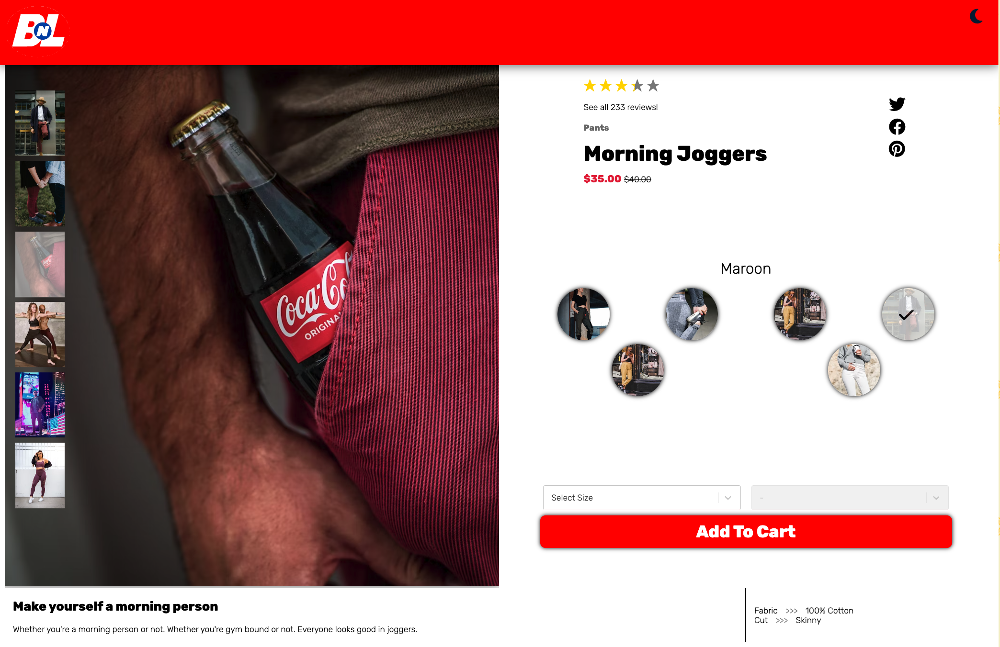
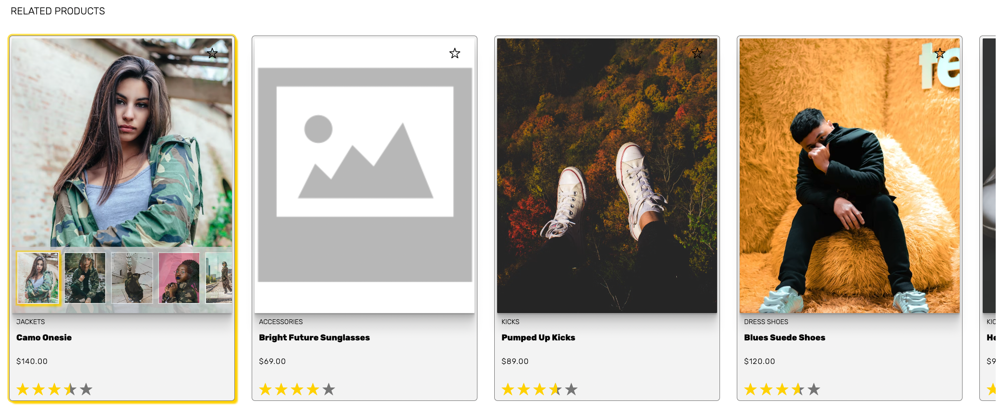
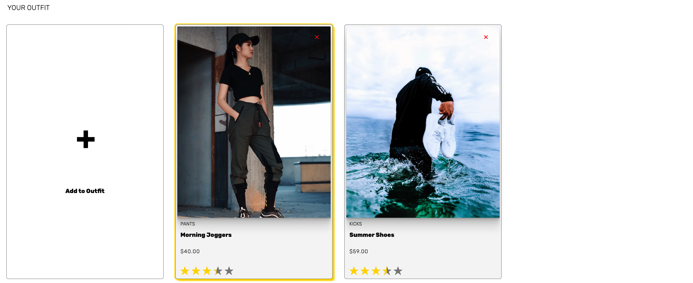
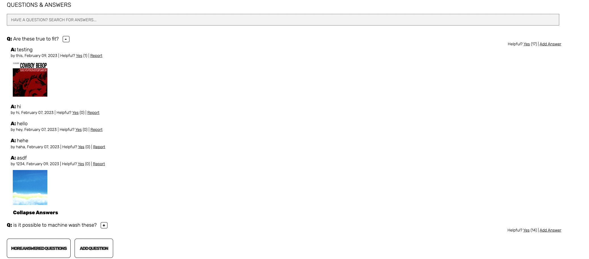

  # FEC - Front End Capstone

Simple overview of use/purpose.

## Table of Contents
  * [Description](#description)
  * [Geting Started](#getting-started)
    * [Git Workflow](#git-workflow)
    * [Dependencies](#dependencies)
    * [Installing](#installing)
    * [Executing program](#executing-program)
  * [Authors](#authors)
  * [Version History](#version-history)

## Description

The front End Capstone is a fullstack app designed to challenge our CSS, HTML, and React skills / knowledge as well as promote growth in these areas.
We chose to desing an E-Commerce website called Buy In Large, a cloth seller based off of the company from the movie Wall-E.
The Website's dsign is entirely based off of the color scheme and theme of the consumer section of the Axiom from the movie.
Our website allows the user to browse a product, its styles, related products, and any Questions and Answers about the said product.
The user scan view different images and styles in the Overview widget, as well as review details, and a description of the product.
This section also contains the Add To Cart componenet, allowing the user to specify a Size and Quantity of the item and then add it to their cart!
Further down the page is the Related Items and Outfit widget which allows the user to view similar and related items to the current product along with some info about those products.
The user can also open a comparison Modal that compares the features of the product versus the current product.
Also within this widget, the user can add items to their outfit, a way of storing products the user likes into an outfit!
At the bottom of our page is the Questions and Answers widget, which allows the user to search through existend questions to see if their question has been answered.
In the case that it is not, they can pose the question themselves with the Question Modal where they can add photos!
Many of these features are shared in the Answers section, where users or the Seller can answer another users question.
Our website also uses URLs that contain the current product ID so you can share the product with friends or family.
The site also allows the user to switch between a light and dark mode.

## Getting Started

### Git Workflow

* Clone FEC

* Create and Move to a new feature:
    * git checkout -b featureName

* Make frequent commits

* Send push to main
    * git push --set-upstream origin featureName

* Create pull request
    * Add what your PR achieves
    * Include any Questions

*  Await code review

### Dependencies

* NPM
* All required libraries ad modules from package.json
```
npm i
```

### Installing

* To download the program, you can clone the repo
* You will have to rename the 'example.env' folder to '.env' and add the port number and API token

### Executing program

* Move into the FEC directory
* Run the following commands:
```
npm run build
npm run start
```
* Then, navigate to the localhost:port!

## Authors

Jacob Davis - Product Overview


Alex Libacova - Related Items and Outfit



Daniel Greaves - Questions and Answers


## Version History

* 0.1
    * Initial Release
